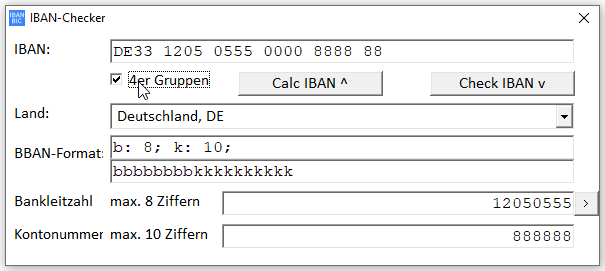

# IBANChecker  
## Calculates from bank account-nr (KNr) and BLZ to IBAN(+BIC) and vice versa  

  
  
  
  

If you get an IBAN-number from another person or company for transfering money to it,
you maybe want to check if the number you got is a valid IBAN-number. You also can
calculate a valid IBAN-number from a given BLZ and bank-account. IBANChecker even let
you know from which country, city and Bank the IBAN number is.
Until now, the delivered file is for banks located in germany only, but you can
search for a list of banks from your country and replace the file.
Project started in jul.2015.

